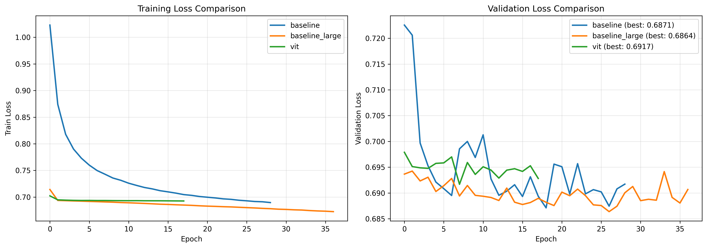
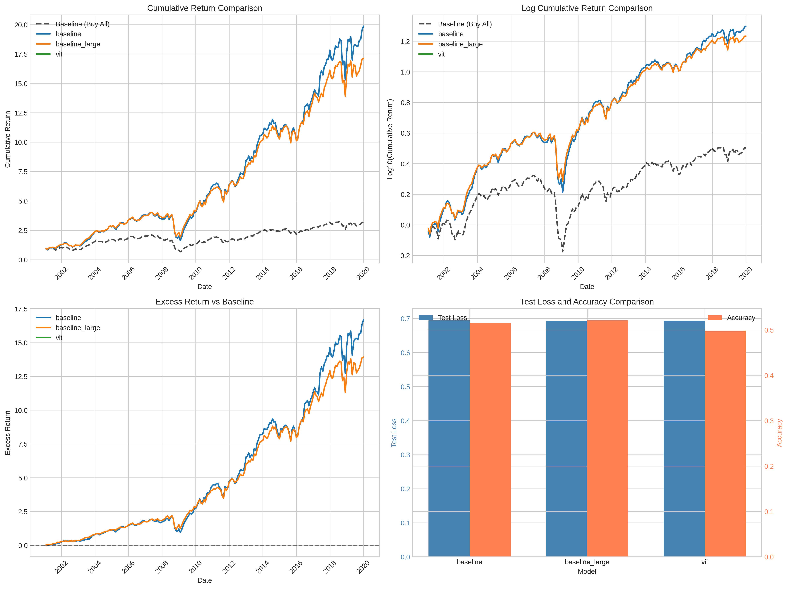

# Stock Image CNN - PyTorch Implementation 

This is a PyTorch implementation of [**(Re-)Imag(in)ing Price Trends**](https://papers.ssrn.com/sol3/papers.cfm?abstract_id=3756587)

## Announcement

This codebase is largely inherit from [Stock_CNN](https://github.com/lich99/Stock_CNN) by [@lich99](https://github.com/lich99).

Re-Implementation Authors:  Gongye Liu, Zixuan Ye, Yatian Wang, Haoqiang Guo, Zhizhou Zhong

---

## 📈 Experiment Results

### Training Results (Three Models Comparison)

| Model | Parameters | Best Epoch | Best Val Loss | Total Epochs |
|-------|------------|------------|---------------|--------------|
| **Baseline** | 0.71M | 18 | 0.6871 | 29 |
| **Baseline Large** | 10.23M | 26 | **0.6864** | 37 |
| **ViT** | 10.82M | 7 | 0.6917 | 18 |

### Test Results (Backtesting 2001-2019)

| Model | Test Loss | Accuracy | Selection % | Cumulative Return | Excess Return |
|-------|-----------|----------|-------------|-------------------|---------------|
| **Baseline** | 0.6942 | 51.58% | 1.85% | **19.86x** | **+16.68** |
| **Baseline Large** | 0.6926 | 52.10% | 4.47% | 17.11x | +13.93 |
| **ViT** | 0.6935 | 49.84% | 0.00% | 1.00x | -2.18 |
| Buy All (Baseline) | - | - | 100% | 3.18x | 0 |

### Key Findings

1. 🏆 **Baseline CNN achieves the best performance** with 19.86x cumulative return over 19 years
2. 📊 **Model complexity doesn't guarantee better results** - the simplest model outperforms larger ones
3. ⚠️ **ViT underperforms** on this task - traditional CNNs are more suitable for stock image classification
4. 💡 **Selective stock picking works** - selecting only 1.85% of stocks yields 6x better returns than buying all

### Performance Visualization

Training Loss Comparison | Test Results Comparison
:-------------------------:|:-------------------------:
 | 

---

## Quick Start

### 🛠️ Installation

#### 1. Create a conda environment and install pytorch
```bash
conda create -n Math5470 python=3.10
conda activate Math5470
pip install torch==2.6.0 torchvision==0.21.0 torchaudio==2.6.0 --index-url https://download.pytorch.org/whl/cu126
```

#### 2. Other dependencies
```bash
pip install -r requirements.txt
```

#### 3. Download data
Download the dataset from this [link](https://dachxiu.chicagobooth.edu/download/img_data.zip), then extract it to the `./data` directory:

```bash
cd Stock_CNN
mkdir -p data
wget https://dachxiu.chicagobooth.edu/download/img_data.zip -O data/img_data.zip
unzip data/img_data.zip -d data/
rm data/img_data.zip
```

---

### 🚀 Training

Run the training notebook to train all three models (Baseline, Baseline Large, ViT):

```bash
cd notebooks
jupyter notebook train.ipynb
```

Monitor the training process with TensorBoard:

```bash
tensorboard --logdir=runs
```

**Training Configuration:**
- Models: Baseline CNN, Baseline Large CNN, Vision Transformer
- Optimizer: Adam (lr=1e-5)
- Batch Size: 1024 (128 × 8 GPUs)
- Early Stopping: Patience = 10 epochs

📄 For detailed training results, see:
- [TRAINING_REPORT.md](./TRAINING_REPORT.md) (中文)
- [TRAINING_REPORT_EN.md](./TRAINING_REPORT_EN.md) (English)

---

### 📊 Testing & Backtesting

Run the test notebook to evaluate all models and perform backtesting:

```bash
cd notebooks
jupyter notebook test.ipynb
```

The test notebook will:
1. Load the best trained models from `./pt/`
2. Run inference on the test set (2001-2019, 1.4M samples)
3. Construct stock selection strategies based on model predictions
4. Compare cumulative returns across all models
5. Generate performance comparison charts in `./pic/`

📄 For detailed test results, see:
- [TEST_REPORT.md](./TEST_REPORT.md) (中文)
- [TEST_REPORT_EN.md](./TEST_REPORT_EN.md) (English)

---

## 📁 Project Structure

```
Stock_CNN/
├── notebooks/
│   ├── train.ipynb              # Training script (all 3 models)
│   └── test.ipynb               # Testing & backtesting script
├── models/
│   ├── baseline.py              # Baseline CNN (0.71M params)
│   ├── baseline_large.py        # Large CNN (10.23M params)
│   └── vit.py                   # Vision Transformer (10.82M params)
├── data/
│   └── monthly_20d/             # Stock image data
├── pt/
│   ├── baseline/best.pt         # Best Baseline model
│   ├── baseline_large/best.pt   # Best Baseline Large model
│   ├── vit/best.pt              # Best ViT model
│   ├── training_results.json    # Training results
│   └── test_results.json        # Test results
├── pic/
│   ├── training_comparison.png  # Training curves comparison
│   ├── test_comparison.png      # Test results comparison
│   └── stocks_selected.png      # Stock selection over time
├── runs/                        # TensorBoard logs
├── TRAINING_REPORT.md           # Training report (Chinese)
├── TRAINING_REPORT_EN.md        # Training report (English)
├── TEST_REPORT.md               # Test report (Chinese)
├── TEST_REPORT_EN.md            # Test report (English)
└── requirements.txt             # Python dependencies
```

---

## 📊 Model Architectures

### Baseline CNN (Recommended)
- 3-layer ConvNet with BatchNorm and LeakyReLU
- Parameters: 708,866 (0.71M)
- Best for: Production use, fast inference

### Baseline Large CNN
- Same architecture with expanded channels (96→192→384)
- Parameters: 10,233,602 (10.23M)
- Best for: When more model capacity is needed

### Vision Transformer (ViT)
- Patch-based transformer with 6 layers
- Parameters: 10,821,314 (10.82M)
- Note: Underperforms on this task

---

## 📚 References

- Paper: [(Re-)Imag(in)ing Price Trends](https://papers.ssrn.com/sol3/papers.cfm?abstract_id=3756587)
- Original Implementation: [Stock_CNN by @lich99](https://github.com/lich99/Stock_CNN)

---

## 📝 License

This project is for educational purposes only. Please refer to the original paper and implementation for licensing details.
